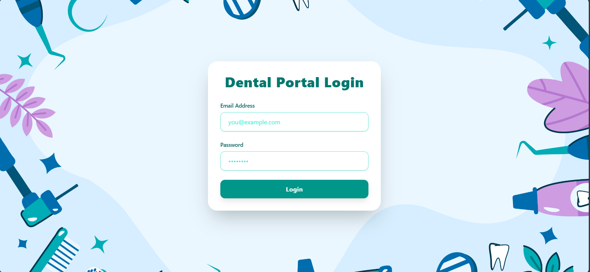

# 🦷 Dental Center Management Dashboard

A role-based Dental Center Management System built with **React**. The dashboard simulates realistic dental clinic workflows for both **Admin (Dentist)** and **Patient** users using **localStorage** only — no backend or external APIs involved.




## 🚀 Live Demo

- **Deployed App**: [https://sagar-dental-center.netlify.app](https://sagar-dental-center.netlify.app/)
- **GitHub Repo**: [https://github.com/sagardubey14/dental-center-dashboard](https://github.com/sagardubey14/dental-center-dashboard)


---

## 🧪 Test User Credentials

Use the following sample users to test authentication and role-based access in the system.

### 👨‍💼 Admin

* **Email:** `admin@entnt.in`
* **Password:** `admin123`
* **Role:** Admin

### 👤 Patient

* **Email:** `john@entnt.in`
* **Password:** `patient123`
* **Role:** Patient
* **Patient ID:** `p1`

> These users are preloaded in the system for development/testing purposes.

---

## 📁 Project Structure

```

src/
├── Components/            # All UI components
│   ├── Admin/             # Admin-specific views and features
│   ├── Appointment/       # Appointment/Incident handling
│   ├── Calendar/          # Calendar views
│   └── Patient/           # Patient dashboard and details
├── context/               # Context API for global state
├── data/                  # Initial seed data (users, patients)
├── AppRoutes.jsx          # Centralized route and role-based access
├── App.jsx                # App shell
├── main.jsx               # Entry point
└── index.css              # Tailwind base styles

````

---

## 🧪 Features

### 🔐 Authentication (Simulated)
- Hardcoded users in `seedUsers.js`
- Login with email/password
- Session persistence using `localStorage`
- Role-based routing and access (`RequireRole` component)

### 🧑‍⚕️ Admin Dashboard
- View KPIs: Revenue, upcoming appointments, top patients
- Patient management: Add, edit, delete patients
- Appointment management:
  - Create/edit incidents
  - Add cost, treatment, status
  - File uploads (PDFs/images as Blob URLs)
- Basic Calendar View: Monthly/weekly
- UI with TailwindCSS and responsive layout

### 👤 Patient Dashboard
- View only their own data
- See upcoming appointments and history
- Treatment history, files, cost — read-only

### 📊 KPIs & Insights
- Total Revenue
- Upcoming Appointments
- Top Patients (by incident count)
- Pending / Completed Treatments

---

## 💡 Tech Stack

| Tech         | Usage                            |
|--------------|-----------------------------------|
| React        | Functional components, SPA        |
| React Router | Navigation + route protection     |
| Context API  | Auth + Global State               |
| React Hook Form | Form validation and control    |
| TailwindCSS  | Styling and responsiveness        |
| Blob URLs    | File uploads (images, PDFs)       |
| localStorage | Data persistence & auth/session   |

---

## 📷 File Upload Handling

- Uploads are stored as Blob URLs via `URL.createObjectURL()`
- Supports multiple files: images, PDFs
- Patient can view attachments in appointment history

---

## 📆 Calendar View

- Simple calendar layout with HTML/CSS
- Clickable days to view treatments
- No third-party calendar library used (custom-built)

---

## ❌ Known Issues / Trade-offs

- Calendar view is static and minimal; lacks drag/drop or external calendar sync
- KPIs are basic; advanced analytics or charts not implemented
- No pagination or search filters for patients/incidents (could be a bonus feature)

---

## 🌐 Deployment

- **Platform**:  Netlify 
- To run locally:

```bash
git clone https://github.com/yourusername/dental-center-dashboard
cd dental-center-dashboard
npm install
npm run dev
````

---

## 📌 Additional Notes

* No backend/API — everything runs on the frontend
* All data operations (CRUD) simulated via `localStorage`
* Fully responsive: works well on mobile, tablet, and desktop

---

**Sagar Dubey** 📧 [sagardubey353@gmail.com](mailto:sagardubey353@gmail.com)